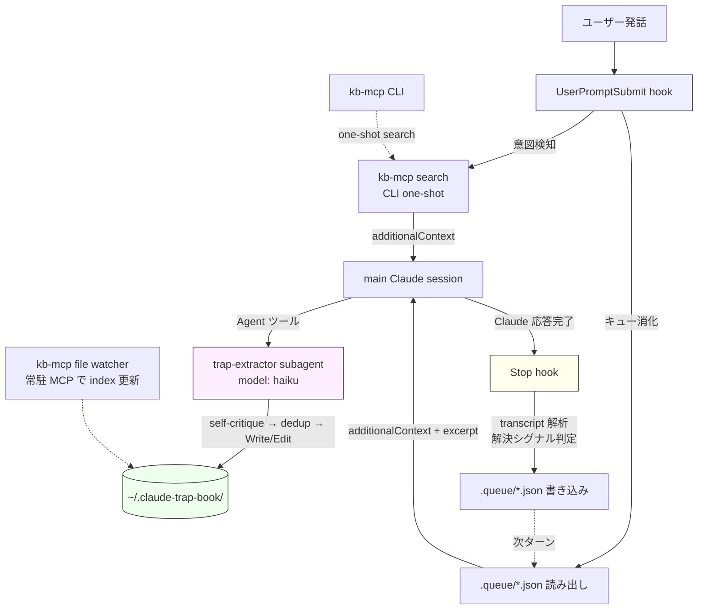
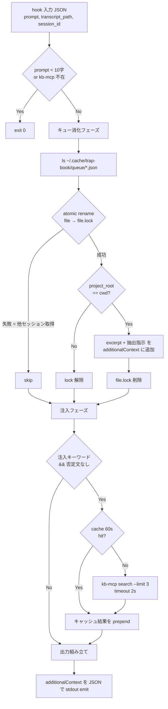
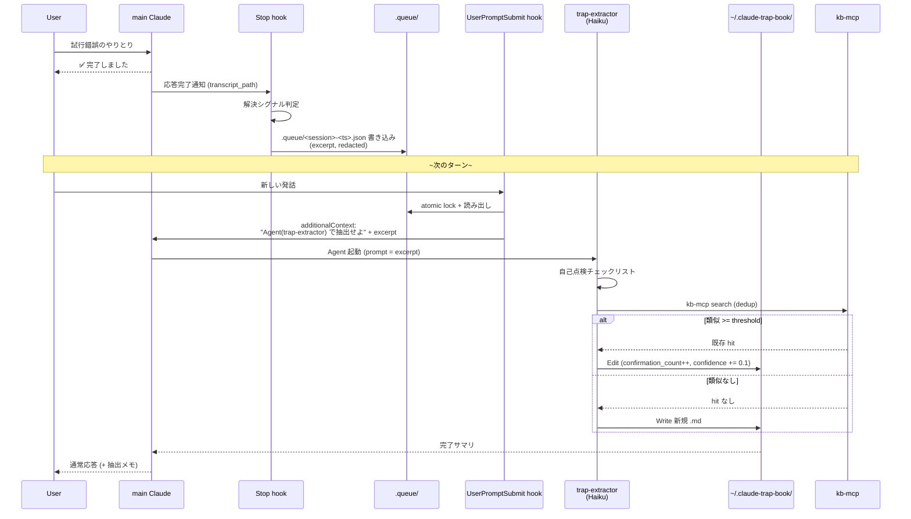

# trap-book プラグイン 設計仕様書

- **プラグイン名**: `trap-book`
- **作成日**: 2026-04-24
- **ステータス**: Draft（ユーザーレビュー待ち）
- **目的**: Claude Code が試行錯誤の末に得た失敗・成功知見を自己抽出し、グローバル KB (`~/.claude-trap-book/`) に蓄積。次セッション以降で最短経路の解決を引き出す

## 目次

- [1. 背景と目的](#1-背景と目的)
- [2. アーキテクチャ概要](#2-アーキテクチャ概要)
- [3. データモデル (frontmatter & 本文)](#3-データモデル-frontmatter--本文)
- [4. コンポーネント詳細](#4-コンポーネント詳細)
- [5. データフロー & ライフサイクル](#5-データフロー--ライフサイクル)
- [6. テスト戦略・観測性・セキュリティ](#6-テスト戦略観測性セキュリティ)
- [7. MVP スコープ・ロードマップ](#7-mvp-スコープロードマップ)
- [8. 未解決論点](#8-未解決論点)
- [9. 参考文献](#9-参考文献)

---

## 1. 背景と目的

### 1.1 問題設定

Claude Code は**セッション間でステートレス**。同じトラップ（失敗パターン）に毎回ハマり、同じ手順で解決しても、次セッションでゼロからやり直す。試行錯誤のコストが累積する。

### 1.2 差別化（既存類似プラグインとの比較）

| 既存プロダクト | 近さ | 限界 |
|---------------|------|------|
| auto memory (Claude Code 組込) | ★★ | ユーザー発話が主トリガー、自己トリガー不在 |
| [reshadat/self-learning-claude](https://github.com/reshadat/self-learning-claude) | ★★★ | プロジェクトごと JSON、横断検索なし |
| [BayramAnnakov/claude-reflect](https://github.com/BayramAnnakov/claude-reflect) | ★★ | 修正発話ベース、解決後抽出ではない |
| [MindStudio: Obsidian × Stop フック](https://www.mindstudio.ai/blog/self-evolving-claude-code-memory-obsidian-hooks) | ★★★ | 同じモデルで抽出するため confirmation bias |

### 1.3 設計原則

1. **自己トリガー抽出**: ユーザー発話依存から解放（AI が試行錯誤 → 解決を自己認識）
2. **抽出者 ≠ 実行者**: confirmation bias 回避のため Haiku subagent が独立コンテキストで抽出 (Moses Njau 2026 による MAR 研究の +6.2pt 改善を踏まえる)
3. **即 active + ソフト管理**: `status: auto_extracted` と `confidence` で品質制御、削除せず `deprecated` フラグ
4. **セマンティック検索**: 既存の `kb-mcp` (Rust 製 MCP server、BGE-M3 + FTS5 ハイブリッド) を活用
5. **プライバシー最優先**: 全ローカル完結、複数レベルのオプトアウト機構
6. **ゼロ・セットアップで動く**: MVP は手動 `/trap-save` のみ、自動抽出は opt-in

---

## 2. アーキテクチャ概要

### 2.1 全体構成



### 2.2 コンポーネントマップ

| コンポーネント | 配置 | 役割 |
|---------------|------|------|
| `hooks/user-prompt-submit.sh` | `plugins/trap-book/hooks/` | 注入 + キュー消化 |
| `hooks/stop.sh` | `plugins/trap-book/hooks/` | 抽出シグナル検知、キュー書き込み |
| `agents/trap-extractor.md` | `plugins/trap-book/agents/` | Haiku subagent、抽出実行 |
| `commands/trap-save.md` | `plugins/trap-book/commands/` | 手動抽出トリガー |
| `commands/trap-search.md` | `plugins/trap-book/commands/` | 手動検索 |
| `commands/trap-setup.md` | `plugins/trap-book/commands/` | 初期化 |
| `skills/trap-book.md` | `plugins/trap-book/skills/` | Claude への使い方ガイド |
| `schema/kb-mcp-schema.toml` | `plugins/trap-book/schema/` | frontmatter validation（kb-mcp validate 用） |
| `lib/redact.sh` | `plugins/trap-book/lib/` | 機密情報マスク |
| `bin/setup.sh` | `plugins/trap-book/bin/` | 初期セットアップ |

### 2.3 ストレージ

```
~/.claude-trap-book/             (chmod 700、kb-mcp --kb-path の対象)
├── pitfall/<YYYY-MM-DD>-<slug>.md    (chmod 600)
├── strategy/<YYYY-MM-DD>-<slug>.md   (chmod 600)
├── kb-mcp-schema.toml
└── config.json                       (dedup_threshold, ttl_days, auto_extract 等)

~/.cache/trap-book/                (chmod 700、kb-mcp 対象外)
├── queue/<session_id>-<ts>.json       (Stop→UserPromptSubmit 連携)
├── queue/.broken/                     (破損 JSON quarantine)
├── logs/YYYY-MM-DD.log                (JSON lines, 7日 rotation)
└── metrics.jsonl                      (append-only)
```

### 2.4 kb-mcp 連携

- hook は **`kb-mcp search` CLI one-shot** のみ使用（MCP server 常駐に依存しない）
- 冷間起動コスト（BGE-M3 初回ロード〜2s）は受容、SLO を冷温分割
- user 既存の MCP server (`ai-knowledge` 等) と KB は分離、`trap-book` 専用 KB
- `.mcp.json` への `trap-book` エントリ追加は手動、`/trap-setup` がコピペ可能な snippet を出力

---

## 3. データモデル (frontmatter & 本文)

### 3.1 frontmatter スキーマ

```yaml
---
# メタ情報
title: "axum で Rc を State に入れると Send エラー"
category: pitfall                  # pitfall | strategy
topic: rust/axum                   # 階層スラッシュ、kb-mcp --topic フィルタ用
date: 2026-04-24                   # YYYY-MM-DD
schema_version: 1                  # 将来マイグレーション用

# 品質・鮮度
status: auto_extracted             # auto_extracted | verified | deprecated
confidence: 0.5                    # 0.0 - 1.0
confirmation_count: 1              # 同一 trap 再抽出で ++
ttl_days: 180                      # 未 verified で TTL 超過 → deprecated

# スコープ
project: claude-plugins            # "*" = グローバル、この1フィールドで scope 表現
tags: [rust, axum]                 # 最大3件、粗粒度（"send-sync" のような細粒度は NG）

# 監査
evidence_sessions:
  - 2026-04-24T14:32:01Z           # .audit/<ts>.md との命名規約対応（命名規約、実ファイル不要）
extracted_by: haiku

# 関連
related:                           # 相対パス、本文 [[wikilink]] と役割分担
  - strategy/2026-04-24-axum-arc-state.md

# strategy カテゴリのみ
supersedes: pitfall/2026-04-24-axum-state-rc.md
superseded_by: []                  # strategy が別 strategy に置き換えられた場合の配列
---
```

### 3.2 本文構造（H2 固定 = Haiku 抽出の few-shot anchor）

**pitfall**:

```markdown
## 症状
<エラーメッセージ・観測事実>

## 原因
<なぜ失敗したか>

## 最短解決手順
1. ...

## やってはいけないこと
- ...

## 関連
- [[strategy/2026-04-24-axum-arc-state]]
```

**strategy**:

```markdown
## 目的

## 手順
1. ...

## なぜこれが効くか

## 適用条件

## 関連
- supersedes: [[pitfall/2026-04-24-axum-state-rc]]
```

### 3.3 kb-mcp-schema.toml（validation 抜粋）

```toml
[fields.category]
required = true
type = "string"
enum = ["pitfall", "strategy"]

[fields.topic]
required = true
type = "string"
pattern = '^[a-z0-9]+(/[a-z0-9]+)*$'

[fields.status]
required = true
type = "string"
enum = ["auto_extracted", "verified", "deprecated"]

[fields.confidence]
required = true
type = "number"
min = 0.0
max = 1.0

[fields.confirmation_count]
required = true
type = "integer"
min = 1

[fields.project]
required = true
type = "string"

[fields.tags]
required = true
type = "array"
min_items = 1
max_items = 3

[fields.date]
required = true
type = "string"
pattern = '^\d{4}-\d{2}-\d{2}$'

[fields.schema_version]
required = true
type = "integer"
min = 1
```

---

## 4. コンポーネント詳細

### 4.1 UserPromptSubmit hook (`hooks/user-prompt-submit.sh`)

責務: (1) 注入意図検知 → `kb-mcp search` CLI → `additionalContext` emit、(2) queue 消化 → 抽出指示 emit。



**キー動作**:
- 注入キーワード例: `実装|作成して|書いて|直して|修正|デバッグ|implement|fix|debug|build`
- 否定フィルタ: Perl 正規表現で `解決していません|まだ動かない|できない` をマッチ → 抽出中止相当
- キャッシュ: `sha256(prompt)[:16]` をファイル名、60秒以内なら再利用
- atomic rename: POSIX `mv` は原子的。lock 衝突 = 別セッションが取った → skip

### 4.2 Stop hook (`hooks/stop.sh`)

責務: transcript から解決シグナルを検知、queue に書き込み。kb-mcp 呼び出しなし。

**解決シグナル（以下のいずれか）**:
1. user 発話に肯定語（`動いた|できた|解決|OK|ありがとう|perfect|works|fixed`）**かつ** (assistant 完了記号 `✅|完了|done|fixed` **または** 直前ツール exit 0)
2. assistant 最終メッセージに tool_use なし + 文末が句点/感嘆符 + 直前文脈に試行錯誤 (同一ファイル複数 Edit、エラー→成功パターン) あり

**否定フィルタ**: user 発話に `まだ動かない|できない|うまくいかない` → 抽出中止。

**queue ファイル書式**:

```json
{
  "session_id": "...",
  "project_root": "<cwd>",
  "created_at": "2026-04-24T14:32:01Z",
  "excerpt": [
    { "role": "user",      "content": "<redacted, 最大 2000 字>" },
    { "role": "assistant", "content": "<redacted, 最大 2000 字>" }
  ]
}
```

excerpt は直前 2 turn のみ（最終 assistant + user 肯定語発話）、`lib/redact.sh` 通過後に保存。

### 4.3 trap-extractor subagent (`agents/trap-extractor.md`)

```yaml
---
name: trap-extractor
description: Internal subagent. Extracts pitfall/strategy from transcript excerpt and writes to ~/.claude-trap-book/. Invoked only by main session after Stop hook queue signal.
tools: Read, Write, Edit, Bash, Glob, Grep
model: haiku
---
```

**システムプロンプト骨子**:

```
あなたは trap-book の抽出エージェントです。以下を実行してください:

1. 渡された transcript excerpt から「試行錯誤 → 解決」パターンを抽出

2. 自己点検チェックリスト（すべて Yes でなければ confidence ≤ 0.3）:
   - [ ] 症状が消えた理由を1行で説明できるか
   - [ ] 同じ原因で再発する条件はあるか
   - [ ] 回避策 (workaround) か根本修正か明示したか
   - [ ] ユーザーの "動いた" は表面的な症状消失ではないか
   - [ ] supersedes 先が自身を参照していないか（循環検出）

3. カテゴリ判定: pitfall / strategy / skip

4. Dedup:
   - kb-mcp search <正規化 title> --category <cat> --topic <topic> --limit 3
   - 類似度 >= config.dedup_threshold の hit があれば既存 Edit
     - confirmation_count++, evidence_sessions += ts, confidence = min(0.9, 現値 + 0.1)
     - confirmation_count >= 3 なら status: verified に昇格
   - hit なしなら Write 新規作成（confidence: 0.5, confirmation_count: 1）

5. Bash 使用は kb-mcp CLI 呼び出しに限定（lib/kb-search.sh wrapper 経由推奨）

6. 結果サマリ（新規 or 既存更新、ファイルパス、confidence）を main に返す
```

### 4.4 Slash commands

| コマンド | 責務 |
|---------|------|
| `/trap-save [category]` | 直近 transcript を trap-extractor に手動で渡す |
| `/trap-search <query>` | `kb-mcp search` を叩いて結果表示 |
| `/trap-setup` | `~/.claude-trap-book/` 作成、`kb-mcp` 存在確認、`.mcp.json` コピペ snippet 表示 |

v0.2.0 で追加:

| コマンド | 責務 |
|---------|------|
| `/trap-review` | auto_extracted エントリを一覧、バッチ UI（`1:v 2:k 3:d 5:x`）で昇格・据え置き・deprecate・削除 |
| `/trap-debug --last N` | 直近ログ表示 |
| `/trap-debug --stats` | metrics.jsonl 集計 |
| `/trap-debug --why-injected <path>` | 特定 trap の注入判定理由 |
| `/trap-export` | KB 全体を JSONL ダンプ |
| `/trap-feedback +1/-1` | 注入された trap が役立ったか、metrics.jsonl に記録 |

### 4.5 skill (`skills/trap-book.md`)

Claude 自身への使い方ガイド。description でトリガー:

> Use when user references trap-book, asks about past pitfalls, or the injection hook has surfaced trap entries. Explains: how to interpret `status: auto_extracted` vs `verified`, when to trust confidence scores, how to manually invoke trap-extractor via Agent tool when automatic triggers miss, redaction safety notes.

### 4.6 Setup (`bin/setup.sh`)

```bash
#!/bin/bash
set -euo pipefail

# 1. ディレクトリ作成
mkdir -p -m 700 ~/.claude-trap-book/{pitfall,strategy}
mkdir -p -m 700 ~/.cache/trap-book/{queue,logs}

# 2. スキーマ配置
cp "$CLAUDE_PLUGIN_ROOT/schema/kb-mcp-schema.toml" ~/.claude-trap-book/

# 3. config.json
cat > ~/.claude-trap-book/config.json <<'EOF'
{
  "dedup_threshold": 0.85,
  "ttl_days_pitfall": 180,
  "ttl_days_strategy": 180,
  "auto_extract": false
}
EOF

# 4. kb-mcp 存在確認 & 最小バージョン (v0.1.0+)
if ! command -v kb-mcp >/dev/null 2>&1; then
  echo "ERROR: kb-mcp not found in PATH. Install from https://github.com/alphabet-h/kb-mcp"
  exit 1
fi
KB_VER=$(kb-mcp --version | awk '{print $2}')
# 最小版 0.1.0 の semver 比較。未満なら中断
if [ "$(printf '%s\n0.1.0\n' "$KB_VER" | sort -V | head -1)" != "0.1.0" ]; then
  echo "ERROR: kb-mcp v0.1.0+ required, found $KB_VER"
  exit 1
fi

# 5. 初回 index
kb-mcp index --kb-path ~/.claude-trap-book/ --model bge-m3

# 6. .mcp.json 追加案内
cat <<'EOF'

=== Next step: add to your .mcp.json ===

"trap-book": {
  "command": "kb-mcp",
  "args": ["serve", "--kb-path", "~/.claude-trap-book/", "--model", "bge-m3"],
  "type": "stdio"
}

=========================================
EOF
```

---

## 5. データフロー & ライフサイクル

### 5.1 注入フロー（UserPromptSubmit）

→ セクション 4.1 の flowchart を参照

### 5.2 抽出フロー（Stop → 次ターン UserPromptSubmit → subagent）



### 5.3 レビューフロー（`/trap-review`、v0.2.0）

- lazy scan: 起動時に `kb-mcp search --status auto_extracted --limit 50` + TTL/減衰フラグ付与
- バッチ UI: 一覧表示 + `1:v 2:v 3:d 5:x` 一括入力
- AskUserQuestion はバッチ結果最終確認のみ

### 5.4 自動ライフサイクルルール（v0.2.0 以降）

| イベント | 動作 |
|---------|------|
| `confirmation_count >= 3` | `auto_extracted → verified`、`confidence → 0.9` |
| `/trap-review` lazy scan 時 | `confidence -= 0.005 × 経過日数`（last_confirmed 基準） |
| `confidence < 0.3` | `→ deprecated`、kb-mcp search から除外 |
| `strategy.supersedes[]` に含まれる pitfall | `→ deprecated`、`superseded_by` 配列更新 |
| `last_confirmed` から `ttl_days` 経過 & 未 verified | `→ deprecated` |

### 5.5 スコープ外

- **セッション跨ぎ抽出**: transcript がセッション別ファイルのため構造上非対応。手動 `/trap-save` で代替
- **transcript 深層分析**: 直近 2 turn のみ、より長い窓は将来拡張
- **multi-agent critique**: v0.3 以降に繰越、GA 後に必要性判明したら検討

### 5.6 設定の優先順位（auto_extract 制御）

自動抽出 (Stop hook の queue 書き込み) は **環境変数優先、config.json フォールバック** で制御する:

```
TRAP_BOOK_AUTO_EXTRACT=1        → 自動抽出 ON（config.json より優先）
TRAP_BOOK_AUTO_EXTRACT=0        → 自動抽出 OFF（config.json より優先）
未設定                          → ~/.claude-trap-book/config.json の "auto_extract" を参照
config.json にもなし            → false（安全側デフォルト）
```

`TRAP_BOOK_DISABLE=1` は**最強の制御**で、全 hook を無条件に silent exit させる（`auto_extract` の値に関わらず注入も抽出も停止）。ただし **slash command (`/trap-save` 等) は影響を受けない** — ユーザーは `TRAP_BOOK_DISABLE=1` 環境下でも手動操作は可能。

### 5.7 queue ファイルの削除責任

queue ファイルのライフサイクル（競合回避の atomic rename パターン）:

1. **Stop hook** が `~/.cache/trap-book/queue/<session>-<ts>.json` を**作成**
2. **UserPromptSubmit hook** が `mv file file.lock` で**ownership 取得**（atomic）
3. UPS hook が `file.lock` の内容を読み、additionalContext に emit
4. UPS hook が emit 完了後、`file.lock` を**削除**（削除責任は UPS hook）
5. `mv` に失敗した（= 別セッションが取った）場合は skip、元ファイルには手を出さない
6. 24h 経過した queue (`created_at` ベース) は `.broken/` に移動し、その後削除

これにより「消し忘れて同じ queue が再処理される」問題を防ぐ。

### 5.8 supersedes / superseded_by の更新責任

**trap-extractor subagent が strategy を新規作成するとき**:

1. `supersedes: pitfall/<path>.md` を含めて strategy を Write
2. **続けて** 参照先の pitfall ファイルを Edit:
   - `status: → deprecated`
   - `superseded_by` 配列に新規 strategy の相対パスを append
3. Edit 対象の pitfall が既に deprecated の場合も `superseded_by` への append のみ実施

**`/trap-review` は supersedes を書き換えない** — これは抽出側の責務。レビューは既存の superseded_by/deprecated 状態を尊重して表示のみ。

循環検出 (A → B → A) は subagent の自己点検チェックリストで阻止。

---

## 6. テスト戦略・観測性・セキュリティ

### 6.1 テスト戦略（3層）

#### Layer 1: bash 単体テスト（bats、データ駆動）

- 対象: 意図検知、否定フィルタ、queue I/O、atomic lock、redact
- fixture: `tests/fixtures/intent/{positive,negative,negation}.txt`、`tests/fixtures/redact/input-*.txt` / `expected-*.txt`
- bats がファイル行ごとにループ assert（fixture 追加のみで網羅性 ↑、diff クリーン）
- kb-mcp 不要、CI で完結
- **v0.1.0 必須**

#### Layer 2: kb-mcp 連携統合テスト

- CI は **`bge-small-en-v1.5`**（130MB）、BGE-M3 は `@slow` タグでローカル/週次のみ
- **スナップショットは ranked ID リストのみ**、スコア値は非決定性のため比較対象外
- 失敗ケース 2 件 (kb-mcp 停止・queue 破損) は bats に昇格
- **v0.2.0**

#### Layer 3: E2E 手動シナリオ

- `tests/scenarios/*.md` にチェックリスト化、5 シナリオ（並行セッション、180日 deprecate、multi-project 分離等）
- **v0.2.0**

### 6.2 観測性

- **ログ**: `~/.cache/trap-book/logs/YYYY-MM-DD.log` JSON lines、7日 rotation、`TRAP_BOOK_DEBUG=1` で stderr 併用
- **メトリクス**: `metrics.jsonl` **append-only**（並行書き込み安全）、初期 3 イベント: `injection_hit`, `extraction_queued`, `dedup_merged`
- **`/trap-debug`**（v0.2.0）でログ・metrics を動的集計

### 6.3 セキュリティ・プライバシー

#### データフロー（README 必須記述）

- trap-book は**全ローカル完結**: kb-mcp はオフライン、Haiku subagent は通常の Claude Code 通信経路
- 生成 `.md` は `~/.claude-trap-book/` のみ、外部送信なし

#### オプトアウト（全 4 レベル）

| レベル | 方法 | slash command への影響 |
|-------|------|----------------------|
| 単発ターン除外 | プロンプト冒頭 `[PRIVATE]` | なし |
| プロジェクト除外 | プロジェクトルートに `.trap-book-ignore` | なし（手動コマンドは使用可） |
| 全面 hook 無効化 | `TRAP_BOOK_DISABLE=1` 環境変数 | **なし** — slash command は引き続き動作 |
| 自動抽出 OFF | `TRAP_BOOK_AUTO_EXTRACT=0` または `config.json.auto_extract=false` | なし（注入と手動抽出は動作） |
| グローバル除外 path | `config.json` の `ignore_paths` 配列 | なし |

上記オプトアウトは **hook のみを対象**とする。ユーザーが明示的に実行する `/trap-save`, `/trap-search`, `/trap-setup`, `/trap-review`（v0.2.0） はユーザー意思として常に動作する — `TRAP_BOOK_DISABLE` 環境下でも手動操作は可能。

#### ファイル権限

- `chmod 700 ~/.claude-trap-book/ ~/.cache/trap-book/`
- `chmod 600 ~/.claude-trap-book/**/*.md`
- setup.sh で強制、既存エントリも強制修正

#### redact（`lib/redact.sh`）

```bash
PATTERNS=(
  '-----BEGIN [A-Z ]+ PRIVATE KEY-----'
  'AKIA[0-9A-Z]{16}'                                    # AWS Access Key
  'eyJ[A-Za-z0-9_-]+\.[A-Za-z0-9_-]+\.[A-Za-z0-9_-]+'   # JWT
  'Bearer [A-Za-z0-9_.+/=-]+'                           # OAuth
  '"private_key":\s*"-----BEGIN'                        # GCP SA
  'api[_-]?key[=:]\s*\S+'
  'password[=:]\s*\S+'
)
```

マッチは `[REDACTED:<label>]` に置換、excerpt 化の最終段階で適用。

### 6.4 パフォーマンス SLO（冷温分割）

| 指標 | 冷間 | 温間 |
|------|-----|-----|
| UserPromptSubmit 注入 | < 5s（2s timeout で search 諦め、注入スキップ） | < 500ms |
| UserPromptSubmit cache hit | - | < 50ms |
| Stop hook | < 200ms | < 100ms |
| trap-extractor subagent | < 15s | < 10s |
| kb-mcp 増分 index | < 1s | < 500ms |

---

## 7. MVP スコープ・ロードマップ

### 7.1 v0.1.0（MVP = 手動運転可能な最小構成）

**含む**:

- `plugin.json`, `README.md`
- UserPromptSubmit hook（注入 + キュー消化）
- Stop hook（解決シグナル検知 + queue 書き込み）
- trap-extractor subagent (Haiku)
- `/trap-save`, `/trap-search`, `/trap-setup`
- kb-mcp-schema.toml validation、`schema_version: 1`
- `lib/redact.sh`（7 パターン）
- オプトアウト全種（4 レベル）
- **自動抽出は opt-in**: `TRAP_BOOK_AUTO_EXTRACT=1` でのみ Stop hook が queue 書き込み（デフォルトは手動のみ）
- Layer1 bats テスト（fixture 駆動、CI）
- ログ + `metrics.jsonl` append-only

**含まない（v0.2.0 に繰越）**:

- `/trap-review`, `/trap-debug`, `/trap-export`, `/trap-feedback`
- confidence 減衰・TTL 自動 deprecate
- Layer2 統合テスト CI、Layer3 E2E 手動シナリオ

**含まない（scope 外）**:

- multi-agent critique
- session 跨ぎ抽出

**受入条件**:

- Layer1 bats 全 pass
- `/trap-save` → Markdown 生成 → `kb-mcp search` hit の E2E 1 回
- `TRAP_BOOK_AUTO_EXTRACT=1` で Stop hook が queue 書き込みまで到達
- `TRAP_BOOK_DISABLE=1` で全 hook silent exit
- redact fixture 全 pass

### 7.2 v0.2.0（成熟）

**追加**:

- Stop hook 自動抽出のデフォルト化（opt-in → opt-out 反転）
- confidence 減衰 (-0.005/day)、自動昇格 (confirmation_count ≥ 3)、自動 deprecate (confidence < 0.3, TTL 超過)
- `/trap-review` バッチ UI、`/trap-debug`, `/trap-export`, `/trap-feedback`
- Layer2 統合テスト CI（bge-small-en-v1.5）
- Layer3 手動シナリオ docs

### 7.3 v1.0.0（GA 判定基準）

- dog-food 1ヶ月で「役に立った注入 (`injection_used: true`)」≥ 10 回
- dedup hit 率 ≥ 30%
- `/trap-review` 操作頻度が 月 1 回以下に収束
- クリティカルバグなし

### 7.4 非機能要件

- **マイグレーション**: `schema_version` を frontmatter に埋め込み、breaking change 時は `bin/migrate.sh`
- **ロールバック**: アンインストール時 KB 本体は削除しない、再インストールで自動復旧、`/trap-wipe`（v0.2.0）で明示削除
- **互換性**: `kb-mcp` major version チェック、非互換は setup.sh 中断

---

## 8. 未解決論点

| # | 論点 | 暫定方針 |
|---|------|---------|
| 1 | bats と Windows | v0.1.0 は WSL/Git Bash 前提、CONTRIBUTING.md 明記。PowerShell shim は別 track |
| 2 | kb-mcp CLI 冷間起動 | CLI one-shot で 2-3s 想定、SLO 冷温分割で受容。user が嫌気すれば HTTP daemon 誘導を v0.2 で検討 |
| 3 | kb-mcp バージョン整合 | **最小対応版: kb-mcp v0.1.0 以上**（`search --format json/text`, `--category`, `--topic`, `validate`, `get_connection_graph` が揃うのが v0.1.0）。setup.sh は `kb-mcp --version` で semver 比較、未満なら中断 |
| 4 | Anthropic API 課金 | Haiku subagent は user サブスクリプションに乗る、opt-in でコスト意識を user 側に残す |

---

## 9. 参考文献

- [reshadat/self-learning-claude](https://github.com/reshadat/self-learning-claude) — Playbook JSON によるプロジェクト固有学習
- [BayramAnnakov/claude-reflect](https://github.com/BayramAnnakov/claude-reflect) — confidence score、修正パターン検出
- [thedotmack/claude-mem](https://github.com/thedotmack/claude-mem) — AI 圧縮 + 未来セッション注入
- [MindStudio: Self-Evolving Claude Code Memory with Obsidian](https://www.mindstudio.ai/blog/self-evolving-claude-code-memory-obsidian-hooks) — Stop フック + vault 構造
- [Moses Njau: The Memory Problem in AI Agents](https://medium.com/data-unlocked/the-memory-problem-in-ai-agents-is-half-solved-heres-the-other-half-ebbf218ae4d5) — 「write/read はできるが manage で失敗する」、multi-agent critique +6.2pt、outcome-based belief extraction
- [kb-mcp README](../../../../kb-mcp/README.md) — Rust 製 Markdown セマンティック検索 MCP server
