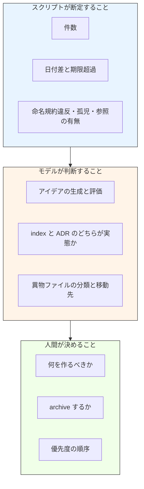

# feature-ideation プラグイン 設計仕様書

- **プラグイン名**: `feature-ideation`
- **作成日**: 2026-08-16
- **ステータス**: v0.1.0 実装済み
- **目的**: 機能アイデアを広く出して vault に貯め、効果・難易度・制約整合で優先度を可視化する。
  ローカルスキルとして 4 ヶ月運用した結果判明した摩擦を潰した上でプラグイン化する

## 目次

- [1. 背景](#1-背景)
- [2. 実運用で観測された摩擦](#2-実運用で観測された摩擦)
- [3. 設計方針](#3-設計方針)
- [4. コンポーネント構成](#4-コンポーネント構成)
- [5. vault フォーマットの設計判断](#5-vault-フォーマットの設計判断)
- [6. 集計スクリプトの設計判断](#6-集計スクリプトの設計判断)
- [7. 検出精度の実測](#7-検出精度の実測)
- [8. v0.1 に入れなかったもの](#8-v01-に入れなかったもの)
- [9. 未解決論点](#9-未解決論点)
- [10. 参考文献](#10-参考文献)

---

## 1. 背景

`~/.claude/skills/feature-ideation/` に置いたローカルスキル（初版 2026-04 頃、最終改修 2026-07-25）を
プラグイン化する。動機は 3 つある。

1. **配布したい** — マーケットプレイスに載せる
2. **仕様が古い** — 規範として参照した Claude Code Skills 仕様は v2.1.123 で、現行との差が約 100 リリースある
3. **git 管理外であることが構造的な負債になっていた** — スキル本体が `~/.claude/` にあるため履歴が残らず、
   別リポジトリに `docs/skill-history/feature-ideation.md` という手書きミラーを維持していた。
   そこに「仕様への準拠確認 未実施」という宿題が 22 日放置されていた。
   **プラグイン化するとスキルが git 管理下に入り CHANGELOG が正史になるため、この負債自体が消える**

## 2. 実運用で観測された摩擦

2 プロジェクト（`kb-mcp` / `ai_organization`）で 4 ヶ月運用した実データを調査した結果。

| # | 摩擦 | 観測された事実 |
|---|---|---|
| 1 | **陳腐化検出が実装されたが一度も実行されなかった** | 2026-07-25 に `check` へ陳腐化検出を必須化したが、`check` は人間が呼ばないと走らない。その改訂の動機になった項目自体が 22 日後も未消化のまま。加えて改訂後に新たなトリガ切れが 2 件発生した |
| 2 | **実装が進んでも index に戻らない** | GO 判定 → ADR → 実装完了が 2 時間で走った案件で、index は起点の状態で凍結。トライアル記録は vault ディレクトリに物理的に置かれたのに、vault からのリンクが 0 本（外部 8 ファイルからは張られていた） |
| 3 | **期限の書式が揺れて拾えない** | 実際に 4 種類の書式が発生し、日付に還元できたのは 1 つだけ。残り 3 つは条件トリガなので日付比較では原理的に検出不能 |
| 4 | **`起票日` カラムが機能しない** | 導入前に生まれた vault には 2 回の大規模棚卸を経ても遡及付与されなかった。もう一方は 30 件中 23 件が同一日（一括ブレストの産物）で分散シグナルにならない |
| 5 | **`closed.md` が一度も生成されなかった** | 片方は棲み分け表に参照だけ書いて壊れリンクを作り、もう片方は vault 本体末尾の 2 表で代替した |
| 6 | **vault ディレクトリのゴミ捨て場化** | 詳細ファイル 10 件のうち 5 件・3,401 行が implementation plan / spec research / トライアル記録 |
| 7 | **優先度ピックがリリースサイクル依存** | リリース概念のないプロジェクトでは初版のまま 104 日 |

**最も重要な発見は、生きている vault の方がテンプレートより優れた形に独自進化していたこと。**
アーカイブ 2 表の内蔵、最終棚卸ヘッダ、条件トリガの `known-issues.md` への隔離（この規律により期限切れ 0 件）は
すべてテンプレートに無い自力の発明だった。**新テンプレートはこの到達点を正とする。**

## 3. 設計方針



方針は 3 つ。

1. **散文の規律を構造に置き換える。** 「件数は実数で数えよ」「日付は今日と比較せよ」という戒めを
   SKILL.md に書くのをやめ、スクリプトが数える。「期限を書くときは日付で」を守らせるために、
   自由文の備考ではなく `期日` 列という宣言されたスロットを用意する
2. **更新コストを実際の作業量に比例させる。** 行ごとの日付列は「全行に触る保守」を要求し、
   実運用では実行されないか捏造される。3 層（vault 全体 / カテゴリ / 個別ファイル）に分ければ、
   どの層も触った分だけ更新される
3. **操作数を減らす。** `closed.md` が守られなかった敗因は 3 操作を要求したこと。
   台帳を vault 本体に内蔵すれば 1 操作（行の移動）で済む

## 4. コンポーネント構成

```
plugins/feature-ideation/
├── skills/feature-ideation/SKILL.md   ルータ + アイデア出しの 6 ステップ
│   └── references/{discuss,archive,evaluation,template}.md
├── skills/check/SKILL.md              状態サマリと陳腐化検出
├── lib/vault-digest.sh                決定的な集計器
└── tests/                             bats + 8 種の fixture
```

スキルを 2 つに分けた理由は、`check` だけが (a) シェルスクリプトの実行権限を必要とし、
(b) hook や `/schedule` から単独で呼ばれる想定があり、(c) 本体を読まずに完結するため。
`discuss` / `archive` は起動頻度が低いので `references/` に退避し、SKILL.md 本体は 135 行に収めた
（旧版は 338 行）。

## 5. vault フォーマットの設計判断

| 判断 | 採用案 | 却下した案と理由 |
|---|---|---|
| ID 体系 | `FI-001`（カテゴリ非依存の通し番号） | `A-1`（カテゴリ + 連番）— カテゴリ解体で ID とカテゴリが恒久的に食い違う事象が実際に発生し、2 階層 ID の衝突も起きた。ID は台帳・ADR から参照される外部キーであり、外部キーに意味を持たせたのが設計ミス |
| 最終確認日 | 3 層（frontmatter `last_sweep` / カテゴリ見出し / 詳細ファイル mtime） | 行ごとの列 — 捏造耐性が無く、更新コストが作業量に比例しない。摩擦 4 と同じ失敗をなぞる |
| 期限 | 独立した `## 再評価キュー` 表（期日 / ID / 何を判定するか / 判定材料） | 8 列目に `再評価` 列 — 9 割が空になる上、「何を判定するのか」を書く場所が無い。実運用で唯一きちんと解決した期限は「判定内容つき」で書かれたものだった |
| アーカイブ | vault 本体末尾の 2 表（実装済み台帳 / 不採用の記録） | 別ファイル `closed.md` — 4 ヶ月で 0 回生成。完了と却下では必要な列が違うのに単一表で混ぜていた |
| 実装からの戻り導線 | 台帳の `証跡` / `知見` を空欄禁止 | 「index も更新すること」と散文で書く — 摩擦 2 で実際に守られなかった。リンクを張らないと行が書けない構造にする |
| 条件トリガ | vault の外（`known-issues.md`）へ隔離 | vault に `frozen` で残す — 逃がし先が無い場合のみの劣化動作とし、5 件を超えたら切り出しを促す |
| ゴミ捨て場化の防止 | ファイル名接頭辞規約（`FI-` / `archive-`）+ 機械検出 | 「plan は writing-plans に任せる」という概念的な境界 — 物理的な関門が無かったため摩擦 6 が起きた |
| 状態 | `idea` / `probing` / `planned` / `frozen` + 終端 2 語 | `partial` — 「1 行に複数アイテムが入っている」症状。正しい形は完了分を台帳へ移して残余に新 ID を切ること |

## 6. 集計スクリプトの設計判断

- **常に exit 0。** 出力は `check` がコンテキスト注入で受け取るため、非 0 で終了すると
  スキル起動ごと abort しモデルは本文を一切見られない。よってリポジトリ内の他のスクリプトと違い
  `set -euo pipefail` を使わない
- **列位置を固定せず、ヘッダ行の列名から解決する。** 実データの 2 vault はスキーマが非互換で、
  片方は同一ファイル内に 3 種類のテーブルヘッダを持っていた
- **日付演算に `date(1)` を使わない。** GNU の `-d` と BSD の `-v` が非互換なため、
  awk 内で `days_from_civil` / `civil_from_days` を持つ[^1]
- **`FEATURE_IDEATION_TODAY` で今日を固定できる。** これが無いと fixture の期限を毎年書き換えることになり、
  テスト自体が腐る（このプラグインが戦っている問題そのもの）
- **出力は JSON ではなくタグ付きの行指向テキスト。** 消費者が LLM だけなので機械パースの利点が無く、
  `jq` 依存か手書きエスケープのコストだけが残る

## 7. 検出精度の実測

実 vault 2 本に対して測定した結果が、検出方式の採否を決めた。

| 方式 | 結果 | 採否 |
|---|---|---|
| 素の ID grep（`\bC-2\b` 等）でリポジトリ全体を走査 | 1 ID あたり 58〜69 ヒット、ほぼ全部が誤検出（別サブプロジェクトが同じ ID 名前空間を使用） | **不採用** |
| `feature-idea` 修飾つきの ID grep | 26 ヒット / **誤検出 0 件**。実在する drift（index が「未判定」のまま、ADR は 22 日前に Accepted）と dangling ID を検出 | **採用** |
| 孤児検出を index からの参照のみで判定 | 10 件中 5 件を flag、うち真の孤児 1 件（誤検出 80%） | **不採用** |
| 孤児検出を 1 hop（index + 他の詳細ファイル）で判定 | 10 件中 2 件を flag、両方が実際に対処を要するもの | **採用** |
| リポジトリ全走査 vs ディレクトリ allowlist | 3.4s vs 0.09s（38 倍） | **allowlist を採用** |

また、`- [x]` や「確定」を含む行を除外しないと、「2026-07-25 に NO-GO 確定」を期限超過として誤報することが
判明したため、完了行フィルタを必須とした。この 2 点は bats の回帰テストとして固定してある。

## 8. v0.1 に入れなかったもの

| 見送ったもの | 理由 |
|---|---|
| `SessionStart` hook による期限の自動通知 | 摩擦 1 の唯一の構造的解だが v0.2。v0.1 は `/loop` や `/schedule` からの定期実行で代替する |
| 相対期限（「2〜3 週間後」）の推定 | アンカーの選択に解釈が入り、正規表現も青天井になる。新フォーマットでは再評価キューに日付で書かせる |
| `harvest`（git log / TODO / 落とし穴 KB からの自動収穫） | v0.2 |
| `promote`（idea → plan 昇格と戻りリンクの自動記入） | v0.2 |
| 機械可読サイドカー（`feature-ideas.json`） | 同期する二本目の真実を持たせない |
| RICE 等の数値スコアリング | 大 / 中 / 小 は 78 件・4 ヶ月で機能している。数値化は偽の精度を生む |
| PowerShell 版の集計スクリプト | 実装が drift すると同じ vault に 2 つの答えが出る。bats で検証できないため drift が検出されないまま出荷される |

## 9. 未解決論点

| # | 論点 | 現状 |
|---|---|---|
| 1 | 既存 2 vault の移行 | ID を `FI-NNN` に付け替えると台帳・ADR・knowledge note からの参照が切れる。ID 対応表を作った上でユーザと手作業で行う（別タスク） |
| 2 | `ペンディング` 欄 | 2 プロジェクト・4 ヶ月で使用実績 0。ただしコストが 3 行で「セッション外の書き込み口」という代替のない役割がある。v0.1 では残し、v0.2 で再評価する |
| 3 | 注入経路の実地検証 | `` !`...` `` によるコンテキスト注入と `${CLAUDE_PLUGIN_ROOT}` の展開は、プラグインをインストールしないと検証できない。E2E の最優先項目 |
| 4 | `check` の自動起動 | v0.1 は `disable-model-invocation` を立てないことでモデル起動を許すのみ。hook は v0.2 |

## 10. 参考文献

- [Extend Claude with skills](https://code.claude.com/docs/en/skills) — SKILL.md frontmatter の現行スキーマ、
  コンテキスト注入、置換変数、スキル一覧の予算
- [Plugin reference](https://code.claude.com/docs/en/plugins-reference) — `plugin.json` スキーマ、
  コンポーネントの自動検出ルール、`${CLAUDE_PLUGIN_ROOT}`
- [Skill authoring best practices](https://platform.claude.com/docs/en/agents-and-tools/agent-skills/best-practices)
  — description の書き方、progressive disclosure、SKILL.md を 500 行以内に保つ指針
- 本リポジトリ `plugins/trap-book/` — bats の構成、`lib/*.sh` のシェル作法、README の型の参照元

[^1]: Howard Hinnant, "chrono-Compatible Low-Level Date Algorithms",
  https://howardhinnant.github.io/date_algorithms.html — グレゴリオ暦の日付を連番に変換するアルゴリズム。
  `date(1)` の GNU / BSD 非互換を回避するために awk へ移植した。
